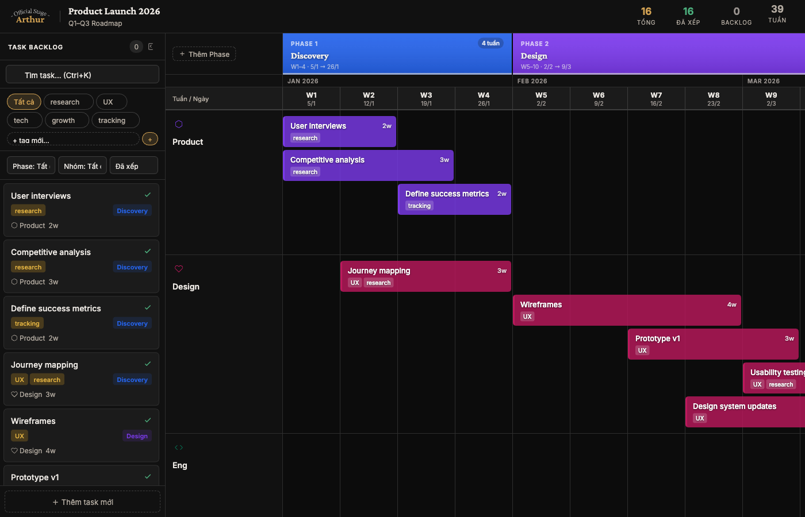

# PROJECT CONTEXT — Arthur Roadmap Timeline
> **Dùng file này để nạp context kỹ thuật ổn định vào đầu mỗi session Claude mới.**
> Đọc kèm `WORKING.md` để biết sprint hiện tại + decisions đã chốt.
> Cập nhật lần cuối: 2026-06-17 · Commit app: `ddc4975` (Phase A) · Commit docs: (file này)

---

## 1. Tổng quan sản phẩm

**Tên:** Aroadmap
**URL Production:** https://aroadmap.cloud (primary) · https://www.aroadmap.cloud · https://aroadmap.vercel.app
**Repo GitHub:** https://github.com/huyc4k42-cell/project-roadmap
**Entry point:** `app.html` (20 dòng) → `src/app/main.js` → 54 ES modules

### Kiến trúc cốt lõi
- **Vite 5 + ES Modules** — 54 modules trong `src/app/` + 7 CSS trong `src/styles/`
- **Firebase 10.12.2** (npm) — Firestore (source of truth) + Auth (Google Sign-In)
- **CDN libs** — lz-string, html2canvas, jsPDF via `window.*` trong app.html
- **localStorage** — cache nhanh (offline fallback) + UI prefs (theme, sidebar, row state)
- **Hash routing** — `#home` → trang chủ, `#project-{id}` → project detail, `#v1=...` → read-only share
- `timeline.html` — **DEPRECATED** monolith cũ, giữ làm backup, không chỉnh sửa

### Deploy
- **Vercel** với `vercel.json` redirect root → `timeline.html`
- **GitHub** repo `huyc4k42-cell/project-roadmap`, branch `main`
- Deploy: **auto** — `git push origin main` → Vercel tự deploy (~30s). Không cần `vercel deploy --prod` nữa.
- **Custom domain:** `aroadmap.cloud` (mua tại Mắt Bão, DNS trỏ về Vercel)
- **Firebase project:** `a-roadmap` (console.firebase.google.com/project/a-roadmap)
- **Firestore:** asia-southeast1, test mode (cần deploy security rules)
- **Auth:** Google Sign-In enabled, domain `project-roadmap-eight.vercel.app` authorized

---

## 2. Data Model (localStorage)

### Firestore Structure
```
/projects/{projectId}         ← mỗi project = 1 document
  ownerId: string             ← Firebase Auth uid
  ownerName: string
  ownerPhoto: string
  name: string                ← = cfg.title
  subtitle: string
  accent: string              ← màu card stripe
  updatedAt: number           ← Date.now()
  stats: { phases, tasks, sched, start, end }
  cfg: object                 ← project config
  phases: array
  teams: array
  tasks: array
  tags: array
  _nextId: number
```

### localStorage Keys (UI prefs + cache)
```
roadmap-proj-{id}      → JSON cache của project data (offline fallback)
roadmap-state-v1       → LEGACY (old single-project format, tự migrate)
roadmap-theme          → 'dark' | 'light' | 'system'
roadmap-row-state      → { scope: 'expanded'|'collapsed', output: 'expanded'|'collapsed' }
roadmap-sidebar-state  → 'expanded' | 'collapsed'
```
> `roadmap-index` không còn dùng — index lấy từ Firestore query

### Index Entry (per project)
```js
{
  id: 'proj_1234567890',
  name: 'Product Roadmap Q3',
  subtitle: 'Mô tả ngắn',
  accent: '#D0A052',          // màu card stripe
  updatedAt: 1234567890000,
  stats: {
    phases: 3,
    tasks: 8,
    sched: 6,                 // số task đã có startWeek
    start: '2025-06-02',      // từ cfg.start
    end: '2025-11-30'         // từ cfg.end
  }
}
```

### Project Data (full)
```js
{
  cfg: {
    title: 'Project Roadmap',
    subtitle: '',
    start: '2025-06-02',      // YYYY-MM-DD, Monday preferred
    end: '2025-11-30',
    scopeRowHeight: 100        // chiều cao Phase Scope row (px), default 100
  },
  phases: [{
    id: 1,                    // số nguyên từ _nextId
    name: 'Discovery',
    startWeek: 1, endWeek: 4, // 1-indexed từ cfg.start
    color: '#1d4ed8',
    scope: 'Mô tả phạm vi...',
    outputs: [{ id: 5, text: 'Research report', done: false }]
  }],
  teams: [{
    id: 2,
    name: 'Product',
    icon: 'package',           // key trong ICONS object
    color: '#7c3aed'
  }],
  tasks: [{
    id: 3,
    name: 'User Research',
    phaseId: 1,               // null = unassigned phase
    teamId: 2,                // null = unassigned team
    startWeek: 1,             // null = Backlog (chưa xếp lịch)
    dur: 2,                   // duration in weeks
    tags: ['ux', 'research'],
    desc: 'Mô tả task...'
  }],
  tags: ['tracking', 'UX', 'tech', 'growth', 'research'],
  _nextId: 10                 // auto-increment ID counter
}
```

---

## 3. Firebase Runtime State

```js
let _db          = null;   // Firestore instance
let _auth        = null;   // Auth instance
let _gProvider   = null;   // GoogleAuthProvider
let currentUser  = null;   // Firebase user object (null = chưa đăng nhập)
let _projIndex   = [];     // in-memory index (synced từ Firestore, không persist)
let _unsubProj   = null;   // onSnapshot cleanup fn cho current project
let _fbSaving    = false;  // guard tránh onSnapshot echo khi chính mình save
```

### Key Firebase Functions
```js
fbSignIn()                  // Google popup sign-in
fbSignOut()                 // sign out + cleanup
_refreshIndex()             // query Firestore → update _projIndex
_saveToFirestore(id, data)  // setDoc với _fbSaving guard
_subscribeToProject(id)     // onSnapshot → real-time collab updates
_migrateLocalToFirestore()  // first-login: localStorage → Firestore
```

---

## 4. State Object (runtime)

```js
const S = {
  cfg: { title, subtitle, start, end, scopeRowHeight },
  phases: [],
  teams: [],
  tasks: [],
  tags: [],
  _nextId: 1,
  ui: {
    filter: { phase: '', team: '', tag: '', status: 'backlog', search: '' },
    modal: null,        // { type, ...data } — xem Modal Types bên dưới
    ctx: null,          // context menu state
    dragData: null,     // { type: 'backlog'|'bar'|'tag', taskId, tag }
    resizeData: null,   // task resize state
    phaseResize: null,  // phase resize state
    phaseDragId: null,  // phase drag/swap state
    teamDragId: null,   // team row reorder state (mới thêm)
    readonly: false,
  }
}
```

### Modal Types (`S.ui.modal.type`)
| Type | Mô tả |
|------|-------|
| `'cfg'` | Cài đặt project (title, dates, week picker) |
| `'add-phase'` | Thêm phase mới |
| `'edit-phase'` | Sửa phase |
| `'add-task'` | Thêm task mới |
| `'edit-task'` | Sửa task |
| `'add-team'` | Thêm nhóm |
| `'edit-team'` | Sửa nhóm |
| `'share'` | Share roadmap (URL encode) |
| `'new-project'` | Tạo project mới (Home screen) |
| `'rename-project'` | Đổi tên + accent + subtitle project |
| `'import'` | CSV import flow (2 bước) |

---

## 4. Layout & Render Pipeline

```
render()
  └── buildHdr()          → header: logo/breadcrumb, stats, buttons
  └── buildSidebar()      → task backlog list (left panel)
  └── buildTimeline()
        ├── phCells        → Phase row (drag/resize handles, week count badge)
        ├── moCells        → Month labels
        ├── wkCells        → Week columns (W1, W2...) — cur week highlighted gold
        ├── teamRows       → buildTeamRow() per team
        │     ├── assignLanes()  → lane algorithm (xem mục 7)
        │     ├── task bars với dynamic height + tags
        │     └── team-drag-handle → kéo để reorder team rows
        ├── scopeTrack     → Phase Scope row (resizable, collapsible)
        └── outTrack       → Output/Checklist row (paste to list, collapsible)
```

```
renderHome()
  └── buildHome()
        ├── buildHomeHdr() → logo center, Import CSV, New Project, Theme toggle
        ├── buildProjCard() per project
        │     ├── accent stripe, title (24px Crimson Pro)
        │     ├── stats row: phases / tasks / sched%
        │     ├── circle SVG progress (weeks elapsed/total)
        │     └── time progress bar (% thời gian đã qua)
        └── buildHomeModal() / buildImportModal()
```

---

## 5. CSS Design System

### CSS Variables (Dark Theme default)
```css
--bg: #080808          /* page background */
--s1: #111111          /* header, sidebar, cards */
--s2: #1b1b1b          /* inputs, timeline bg */
--s3: #262626          /* hover states */
--s4: #303030          /* disabled elements */
--bd: #2e2e2e          /* borders */
--bd2: #3e3e3e         /* stronger borders */
--txt: #ede9e4         /* primary text */
--txt2: #b2aaa0        /* secondary text */
--txt3: #857d75        /* placeholder/muted — ⚠️ WCAG fail, cần fix → #9a9490 */
--gold: #D0A052        /* accent/primary action */
--goldD: rgba(208,160,82,.18)  /* gold bg tint */
--grn: #4caf7d         /* success */
--red: #e05757         /* error/danger */
--sb: 288px            /* sidebar width */
--tlw: 204px           /* timeline label col width */
--ww: 64px             /* week column width (recalculated by calcWW()) */
--hdr: 58px            /* header height */
```

### Light Theme: `[data-theme="light"]` override tất cả vars trên.

### Fonts
- **Crimson Pro** (Google Fonts) — serif, dùng cho titles, phase names, project names
- **Inter** — sans-serif, dùng cho UI text

---

## 6. Key Constants

```js
const TLW = 204              // timeline label col width (px)
const WW_FILL_COLS = 9       // số cột tối đa khi fill
const LANE_PAD = 10          // padding trên/dưới mỗi team row (px)
const LANE_GAP = 5           // khoảng cách giữa các lane (px)
const PHASE_COLORS = [       // màu auto-assign cho phases
  '#7c3aed','#1d4ed8','#047857','#b45309',
  '#be185d','#0e7490','#7f1d1d','#1e3a5f','#4a1942','#14532d'
]
const PROJ_ACCENTS = [       // màu accent cho project cards
  '#D0A052','#7c3aed','#1d4ed8','#047857',
  '#be185d','#0e7490','#b45309','#e05757'
]
```

---

## 7. Algorithms

### Task Bar Height
```js
function taskBarH(task) {
  const longTitle = task.name.length > 22;
  const hasTags   = task.tags?.length > 0;
  return 12 + (longTitle ? 36 : 20) + (hasTags ? 22 : 0);
  // Short/no tags: 32px | Long/no tags: 48px | Short+tags: 54px | Long+tags: 70px
}
```

### Lane Assignment — `assignLanes(tasks)`
**Logic hiện tại (sau refactor 2026-06-02):**
- Tasks cùng phaseId → mỗi task 1 lane riêng, xếp dọc theo thứ tự trong `S.tasks`
- Phase groups sort theo `startWeek` (thứ tự visual trái→phải)
- Tasks không có phase (phaseId=null) → greedy side-by-side packing
- ⚠️ **Bug đã biết:** greedy packing cho no-phase tasks có lỗi loop không chạy → cần fix (xem WORKING.md Wave 1)

```js
assignLanes(tasks)
// → { assignments: {taskId: laneIndex}, numLanes, laneH: [maxHPerLane] }
// Top offset = LANE_PAD + Σ(laneH[0..lane-1]) + lane * LANE_GAP
```

### Team Reorder — `reorderTeam(dragId, targetId)`
```js
// Kéo team handle → insert dragId trước targetId trong S.teams array
// Triggers: pushHistory() → splice → render()
```

---

## 8. Features Implemented

### Auth & Cloud Sync
- [x] **Google Sign-In** — Firebase Auth, popup flow
- [x] **Sign-in screen** — khi chưa login, home hiện CTA thay vì project list
- [x] **User avatar + name** — hiện trong home header khi đã login
- [x] **Auto-migration** — first login tự động migrate localStorage projects lên Firestore
- [x] **Real-time sync** — `onSnapshot` cập nhật UI khi device khác save
- [x] **localStorage cache** — offline fallback, write-through khi save

### Core Timeline
- [x] Phase bar: drag-to-move, resize handles (left/right), week count badge
- [x] Team rows: task bars drag-drop từ backlog vào timeline
- [x] Task bars: dynamic height (title length + tags), tag chips không có # prefix
- [x] Task resize (left/right handles)
- [x] Task stacking: lane algorithm, không bao giờ overlap
- [x] **Team row reorder:** grip handle ở cuối label → drag để đổi thứ tự
- [x] **Task reorder trong phase:** insert-before với gold line indicator (không swap)
- [x] Backlog sidebar: task list, search, tag pills, 3 selects (Phase/Nhóm/Trạng thái) — tag select đã xoá
- [x] **Sidebar collapse rail:** thu gọn thành 48px rail với icon + badge số backlog
- [x] Phase Scope textarea (lưu per phase, resizable height, **collapsible**)
- [x] Output/Checklist per phase (paste multi-line, **collapsible**)
- [x] Row collapse state nhớ qua reload (`roadmap-row-state`)
- [x] Today line indicator (2px, gold "Hôm nay" label trên week row)
- [x] Dark/Light/System theme toggle
- [x] **Modal focus trap** — Tab/Shift+Tab cycle trong modal, auto-focus first input
- [x] Share roadmap (URL encode + LZ compress)
- [x] Export PDF (html2canvas + jsPDF, tự expand scope/output trước capture)
- [x] Week picker calendar (click month → chọn range)
- [x] Keyboard shortcuts: Ctrl+Z undo, Ctrl+K search, Escape đóng modal
- [x] Tag system: filter, color palette, drag-drop tag onto task
- [x] Context menu: right-click task bar / team label

### Sign-in Screen (Auth Gate)
- [x] **Full-screen canvas animation** — dot matrix, 30% gold + 70% white/gray
- [x] **Dot shape:** rounded square via `roundRect()` (không phải circle)
- [x] **Dot config:** GRID=13px, DOT=2.6px half-size, CORN=0.9 corner radius
- [x] **Twinkling:** port GLSL shader logic — jump qua `OP_LEVELS=[0.3…1.0]` mỗi 4.5s
- [x] **Reveal animation:** dots hiện ra từ center ra rìa (delay = dist * 0.042)
- [x] **Radial opacity mask:** `edgeMult = 0.04 + 0.96*(distNorm²)` — tối center, sáng rìa
- [x] **CSS radial overlay:** `ellipse 44% 16% at 50% 40%` — chỉ phủ text area
- [x] **Logo** pinned top-center + dark blur strip (`auth-logo-bg`)
- [x] **Title:** "Turn your roadmap into reality." (Crimson Pro 40px serif)
- [x] **Glassmorphism button:** `backdrop-filter:blur(14px)` + `rgba(255,255,255,.04)`
- [x] **Legal text:** "By logging in, you agree to Policies, Privacy Notice, Cookie Notice."
- [x] Self-terminating RAF loop khi canvas bị remove khỏi DOM

### Multi-Project Home Screen
- [x] Project cards grid: title 24px Crimson Pro, accent stripe 4px
- [x] Card stats: phases / tasks / sched% / time bar / circle week progress
- [x] Hash routing `#home` / `#project-{id}`
- [x] Project CRUD (Create, Rename, Duplicate, Delete)
- [x] Accent color picker
- [x] Empty state

### CSV Import
- [x] 2-step flow: chọn project → preview table
- [x] Schema: `task_name, phase_name, team_name, start_date, end_date, tags, description`
- [x] Auto-create phases + teams từ CSV
- [x] Download CSV template

### Known Limitations (Won't Fix — documented)
- ❌ Mobile responsive — desktop only
- ❌ Keyboard drag-drop alternative
- ❌ CSS token rename (--s1, --s2...)
- ❌ Google Sheets template URL (placeholder hiện tại)
- ❌ Phase scope per-block resize (toàn row resize only)
- ✅ **Firestore security rules** — deployed 2026-06-07 (owner-only access, không còn test mode)

---

## 9. Known Patterns & Conventions

### Render Pattern
```js
// Mỗi thay đổi data → gọi render() (project) hoặc renderHome() (home)
// render(noSave=false) → render HTML + bind events + saveState (nếu noSave=false)
// Không dùng virtual DOM — innerHTML replace toàn bộ mỗi lần render
// renderRAF() → debounce via requestAnimationFrame (dùng khi drag/resize)
```

### Helper Functions hay dùng
```js
q('#id')             // document.querySelector shorthand
qAll('.class')       // document.querySelectorAll shorthand
esc(str)             // HTML escape
nextId()             // trả về S._nextId++ (auto-increment)
saveState()          // save toàn bộ S vào localStorage
saveIndex()          // save roadmap-index (home screen stats)
render(true)         // re-render không save (live-update)
rerender()           // render() hoặc renderHome() tùy currentProjId
showToast(msg, dur)  // toast notification (3s default)
pushHistory()        // save undo snapshot trước khi mutate
```

### Date Functions
```js
parseDate('2025-06-02')   // → Date object
dateStrYMD(dateObj)       // → 'YYYY-MM-DD'
startMonday('2025-06-02') // → Date của thứ 2 đầu tuần
weekDate(weekNum)         // → Date của ngày đầu tuần N
weekLabel(weekNum)        // → 'DD/MM' string
totalWeeks()              // → số tuần trong project
todayWeekFrac()           // → vị trí today (fractional week number)
```

### ID System
- Tất cả entities (phase, team, task, output) dùng integer ID từ `_nextId`
- `nextId()` tự increment `S._nextId`
- Không dùng UUID

---

## 10. Files trong Project Directory

```
[Claude] Project Roadmap/
├── app.html               ← App entry point (Vite, 20 dòng) — serve tại /app
├── index.html             ← Landing page (~1120 dòng) — serve tại /
├── src/
│   ├── app/
│   │   ├── main.js        ← entry wiring, router init
│   │   ├── router.js      ← hash routing (#home, #project-*, #v1=...)
│   │   ├── state.js       ← S object + mutators
│   │   ├── firebase.js    ← Auth + Firestore init
│   │   ├── persistence.js ← createProject, loadProject, saveCurrentProject
│   │   ├── algorithms.js  ← assignLanes, rowMetrics, reorderTeam
│   │   ├── constants.js   ← ICONS, PHASE_COLORS, PROJ_ACCENTS, keys
│   │   ├── date.js        ← weekLabel, calcWW, taskBarH (44px fixed)
│   │   ├── utils.js       ← q(), qAll(), esc(), tagPalette()
│   │   ├── theme.js       ← dark/light/system toggle
│   │   ├── storage.js     ← localStorage helpers
│   │   ├── weekpicker.js  ← calendar date-range picker (dùng trong cfg modal)
│   │   ├── canvas.js      ← dot-matrix animation (sign-in + home empty state)
│   │   ├── share.js       ← buildShareURL, loadFromHash (#v1=...)
│   │   ├── icons.js       ← svgIcon(), LOGO_IMG, logoUrl
│   │   ├── render/
│   │   │   ├── index.js   ← render(), buildApp(), rerender(), WW
│   │   │   ├── home.js    ← renderHome(), buildHome(), buildHomeHdr()
│   │   │   ├── timeline.js← buildTimeline(), buildTeamRow(), buildPhaseRow()
│   │   │   ├── sidebar.js ← buildSidebar(), buildTaskCard()
│   │   │   └── modals.js  ← buildModal(), renderModal(), openModal(), closeModal()
│   │   ├── events/
│   │   │   ├── bind.js    ← bind() — toàn bộ event listeners trong project view
│   │   │   ├── bindHome.js← bindHome() — home screen events
│   │   │   ├── bindModal.js← bindModal() — modal CRUD + color/icon picker
│   │   │   └── resize.js  ← task resize, phase resize, scope row resize
│   │   ├── import/csv.js  ← CSV import (2-step flow)
│   │   └── export/pdf.js  ← html2canvas + jsPDF export
│   ├── styles/
│   │   ├── main.css       ← CSS variables, animations, base reset
│   │   ├── base.css       ← global elements (body, scrollbars, modals shell)
│   │   ├── layout.css     ← header (2-row), breadcrumb, buttons, .body split
│   │   ├── sidebar.css    ← backlog sidebar, rail collapse, tags, task cards
│   │   ├── timeline.css   ← phases, weeks, team rows, task bars, scope/output
│   │   ├── modals.css     ← modal overlay, inputs, icon grid, weekpicker
│   │   └── home.css       ← home screen, project cards, empty state
│   └── assets/logo.png
├── dist/                  ← Vite build output (gitignored, Vercel builds fresh)
├── vite.config.js         ← Vite config (input: app.html + index.html)
├── package.json           ← npm scripts: dev (port 3333), build, preview
├── vercel.json            ← rewrites: /app → app.html
├── firestore.rules        ← Firestore security rules (đã deploy 2026-06-07)
├── firebase.json + .firebaserc ← Firebase CLI config
├── timeline.html          ← ⚠️ DEPRECATED — monolith cũ, đừng chỉnh sửa
├── screenshot.png         ← 1400×900 demo screenshot cho landing page
└── .claude/launch.json    ← Preview: "vite-app" npm run dev port 3333
```

---

## 10b. Landing Page Architecture (`index.html`)

### Stack
- **Vanilla HTML/CSS/JS** — không có React, không có build tool
- **GSAP 3.12.5 + ScrollTrigger** (CDN) — tất cả animation
- **Firebase JS SDK 10.12.2** (CDN, ES module) — chỉ dùng Firestore để capture waitlist email
- **Google Fonts** — Crimson Pro (serif) + Inter (sans-serif)

### Sections
```
#nav        → floating pill nav, IntersectionObserver scroll state
#hero       → canvas dot animation (same engine as sign-in screen), hero headline + CTA
#problem    → 2-col grid: headline + 3 problem items
#demo       → ContainerScroll 3D tilt section (xem bên dưới)
#features   → bento-style features grid
#how        → 3-step horizontal timeline
#waitlist   → email capture form → Firestore /waitlist/{email}
footer
```

### ContainerScroll Animation (`#demo`)
Replicates Aceternity UI ContainerScroll (framer-motion) bằng GSAP + CSS 3D transforms.

**HTML structure:**
```html
<section id="demo">
  <div class="demo-perspective">              <!-- perspective: set via CSS -->
    <div class="demo-hdr" id="demo-hdr">     <!-- text header, drifts up on scroll -->
      <p class="demo-eyebrow">…</p>
      <h2>See the whole picture.</h2>
    </div>
    <div class="demo-device-wrap" id="demo-device-wrap">  <!-- 3D card -->
      <div class="demo-device">
        <div class="device-top">             <!-- macOS traffic-light chrome -->
          <div class="device-dots">…</div>   <!-- red/yellow/green dots -->
          <div class="device-bar">…</div>    <!-- URL bar -->
        </div>
        <div class="device-screen">
                   <!-- 1400×900 app screenshot -->
        </div>
      </div>
    </div>
  </div>
</section>
```

**GSAP animation (ScrollTrigger scrub):**
```js
gsap.set('#demo-device-wrap', {
  rotateX: 20,           // initial tilt
  scale: 1.05,           // initial scale-up
  transformOrigin: '50% 0%',
  transformPerspective: 1200,
});

// Timeline animates from entry to completion:
tl.to('#demo-device-wrap', { rotateX: 0, scale: 1, ease: 'none' }, 0);
tl.to('#demo-hdr',         { y: -72, ease: 'none' }, 0);  // header drifts up

scrollTrigger: {
  trigger: '#demo',
  start: 'top 72%',     // device starts animating when section top hits 72% viewport
  end: 'top 8%',        // animation complete when section top hits 8% viewport
  scrub: 1.8,
}
```

**Key CSS classes (demo section):**
```
.demo-perspective       → perspective container (max-width 1060px)
.demo-eyebrow           → gold uppercase label "ONE VIEW EXACTLY WHERE THEY BELONG"
.demo-hdr h2            → serif title "See the whole picture." (~5.5rem)
.demo-device-wrap       → 3D-animated card wrapper, margin-top:-1.5rem (overlap title)
.demo-device            → border-radius:20px, border:3px solid #3a3a3a, bg:#1d1d1d
.device-top             → macOS chrome bar (bg:#252525)
.device-dot:nth-child(1/2/3) → #ff5f57 / #febc2e / #28c840 (traffic lights)
.device-screen          → aspect-ratio:16/9, overflow:hidden
```

### screenshot.png
- **Size:** 1400×900px, PNG, ~193KB
- **Content:** App timeline với demo data (Product Launch 2026, 4 phases, 4 teams, 16 tasks)
- **Capture method:** Preview browser (port 3333) → LZString hash URL → `html2canvas()` → `fetch POST` → Python HTTP server (port 8765) → ghi file
- **Demo data:** được nén bằng LZString trực tiếp trong browser qua `preview_eval`, load qua share URL `#v1=...` không cần auth
- **Tái tạo:** Chạy preview server port 3333, navigate `timeline.html`, dùng eval inject hash + html2canvas

### Waitlist / Firebase
```js
// index.html dùng Firebase app riêng (named 'landing') để tránh xung đột với app chính
const fbApp = initializeApp(firebaseConfig, 'landing');
const db = getFirestore(fbApp);
// Save: setDoc(doc(db, 'waitlist', email), { email, ts: serverTimestamp(), src: 'landing' })
```
Firestore rules cho `/waitlist/{email}`: `allow create: if true; allow read/write/delete: if false;`

---

## 11. Design Decisions Log

> Append-only. Không xóa entry cũ — dùng để trace lý do đằng sau các quyết định.

### [2026-06-07] Firebase Integration
| # | Quyết định |
|---|-----------|
| D12 | Auth required — không có account không xem được project (trừ read-only share link) |
| D13 | Storage: Firestore là source of truth, localStorage là write-through cache (offline fallback) |
| D14 | Real-time: `onSnapshot` + `_fbSaving` guard để tránh echo loop khi chính mình save |
| D15 | Migration: first login tự detect localStorage projects → migrate lên Firestore, không hỏi |
| D16 | `_projIndex` in-memory array thay cho `localStorage roadmap-index` — không persist index riêng |
| D17 | Collaborator: hiện tại chỉ owner (last-write-wins). Invite/share role để sau. |
| D18 | ✅ Security rules: đã deploy lên production 2026-06-07. Owner-only read/write. |

### [2026-06-08] Landing Page — Demo Section Redesign
| # | Quyết định |
|---|-----------|
| D24 | ContainerScroll effect bằng GSAP + CSS 3D (không dùng framer-motion/React) — project là vanilla HTML, zero framework |
| D25 | macOS traffic-light chrome (#ff5f57/#febc2e/#28c840) thay browser-chrome cũ — cảm giác "product demo" chuyên nghiệp hơn |
| D26 | `transformPerspective: 1200` đặt trực tiếp trên element qua GSAP (không dùng `perspective` trên parent CSS) — GSAP ownership rõ ràng, tránh conflict |
| D27 | Negative margin-top `-1.5rem` trên device wrap để device overlap title — tạo depth illusion như framer-motion Card `-mt-12` |
| D28 | `scrub: 1.8` (cao hơn default 1) — animation mượt, không giật khi scroll nhanh |
| D29 | screenshot.png: capture qua html2canvas trong preview browser (không dùng Chrome headless CDP) — headless Chrome không chạy được Firebase ES module imports từ CDN |

### [2026-06-08] screenshot.png — Capture Method
| # | Quyết định |
|---|-----------|
| D30 | Dùng LZString share URL (`#v1=...`) để load demo data không cần auth — `loadFromHash()` không require Firebase/currentUser |
| D31 | Demo data compress trong browser bằng `preview_eval` (không pre-compute ở Python) — tránh encoding mismatch với dấu `+` trong URL |
| D32 | html2canvas `document.body` thay vì element cụ thể — capture toàn bộ viewport 1400×900 đúng layout |
| D33 | Ẩn `.ro-banner` bằng CSS inject + click `#stat-sched` để show scheduled tasks trong sidebar trước khi capture |

### [2026-06-07] Sign-in Screen Redesign
| # | Quyết định |
|---|-----------|
| D19 | Sign-in screen = full-screen standalone, không dùng home header — auth là entry point độc lập |
| D20 | Canvas 2D thay vì WebGL/Three.js — đủ cho effect này, zero dependency thêm vào |
| D21 | Twinkling: port discrete jump logic từ GLSL shader (OP_LEVELS array mỗi 4.5s) thay vì sin liên tục — đúng với ref |
| D22 | CSS radial mask chỉ phủ text area (`44% 16% at 50% 40%`), button để dots thấy qua glass blur |
| D23 | Dot shape: `roundRect()` thay vì `arc()` — phù hợp aesthetic boxy của app |

### [2026-06-03] UX Overhaul — Grill-me Session
| # | Quyết định |
|---|-----------|
| D01 | Sidebar collapse → thin rail 48px (icon list + badge số backlog tasks). Click để expand. |
| D02 | Muốn drag task từ backlog khi rail collapsed → phải expand sidebar trước, không có flyout. |
| D03 | Filter sidebar: xoá select "Tag" (trùng với tag pills). Giữ tag pills (dual: filter + drag source). Gộp Phase/Nhóm/Trạng thái thành 1 row. |
| D04 | Task drag-reorder trong cùng phase+team: **insert before** target (không swap). |
| D05 | Insert-before visual indicator: **gold line ngang phía trên** task target. |
| D06 | Phase Scope & Output rows: có toggle collapse riêng, nhớ state per-row trong `roadmap-row-state` localStorage. |
| D07 | First-run default (chưa có localStorage): cả 2 rows expanded. |
| D08 | "Hôm nay" label gắn vào **week column sticky (week row)**, màu gold, cùng highlight `.wk-c.cur`. |
| D09 | Header stats (Tổng/Đã xếp/Backlog/Tuần): giữ nguyên, chưa xử lý declutter. |
| D10 | CSS token rename (--s1 → --surface-base...): **bỏ qua**, zero user value, rủi ro cao. |
| D11 | Keyboard drag-drop alternative: **bỏ qua**, known limitation. |

---

## 12. Quick Debug Checklist

Khi gặp lỗi, kiểm tra theo thứ tự:

1. **Console errors?** → F12 → Console
2. **WW âm?** → `window.innerWidth` quá nhỏ, `calcWW()` có guard `Math.max(60, ...)`
3. **Modal không đóng?** → Kiểm tra `S.ui.modal = null` rồi gọi `render()`/`renderHome()`
4. **Task không lưu?** → `saveState()` có được gọi không?
5. **Import không navigate?** → `location.hash = '#project-' + projId` sau `saveIndex()`
6. **Dropdown menu bị clipped?** → `.proj-card` không được có `overflow:hidden`
7. **Context menu lệch?** → `.proj-ctx` dùng `top: calc(100% + 4px)` (không phải `bottom`)
8. **Drag state bị stuck?** → Kiểm tra `S.ui.dragData`, `S.ui.teamDragId`, `S.ui.phaseDragId` — Escape phải reset hết
9. **Lane overlap?** → `assignLanes()` — phase tasks dùng sequential lanes, no-phase dùng greedy. Xem bug note mục 7.
10. **Sign-in canvas không chạy?** → Kiểm tra `document.getElementById('auth-dot-canvas')` tồn tại, `initSignInCanvas()` được gọi trong `bindHome()`, và `currentUser === null`.

---

## 13. Deployment Checklist

```bash
cd "/Users/arthur/Desktop/[Claude] Project Roadmap"
git add timeline.html PROJECT_CONTEXT.md WORKING.md
git commit -m "feat: mô tả thay đổi"
git push origin main
# → Vercel tự động deploy, live tại aroadmap.cloud sau ~30 giây
```

**Vercel project ID:** `prj_o0iwuBDrXnp8BRdKLNKR1vMRphyx`
**Team ID:** `team_P9FfhTlhYVKuixkXkc9Ge26j`

### Firebase Deployment (security rules)
```bash
# Cần firebase-tools đã install + login
firebase login
firebase init firestore   # chọn project a-roadmap
firebase deploy --only firestore:rules
```

**Firebase project:** `a-roadmap`
**Firestore region:** `asia-southeast1`
**Auth domain:** `aroadmap.cloud`, `www.aroadmap.cloud`, `aroadmap.vercel.app` (đã authorized trong Firebase)

### Firestore Security Rules (production-ready)
```
rules_version = '2';
service cloud.firestore {
  match /databases/{database}/documents {
    match /projects/{projectId} {
      allow read, write: if request.auth != null
        && resource.data.ownerId == request.auth.uid;
      allow create: if request.auth != null
        && request.resource.data.ownerId == request.auth.uid;
    }
  }
}
```
